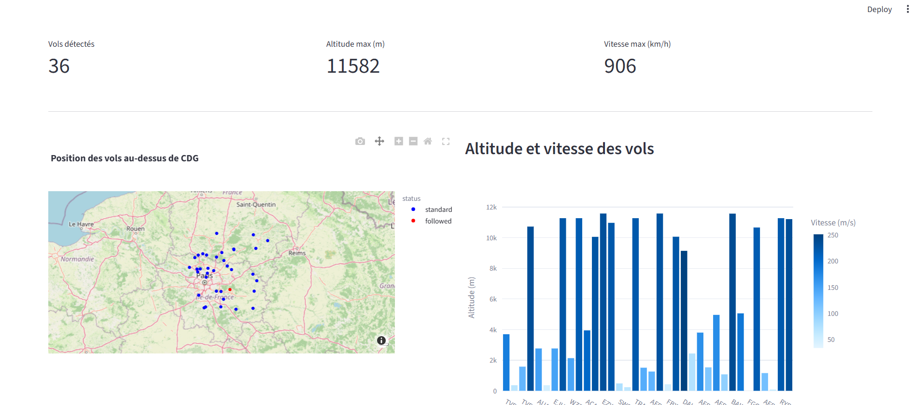
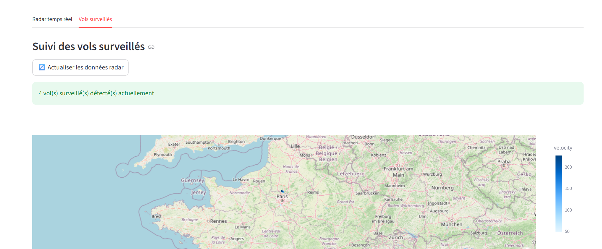
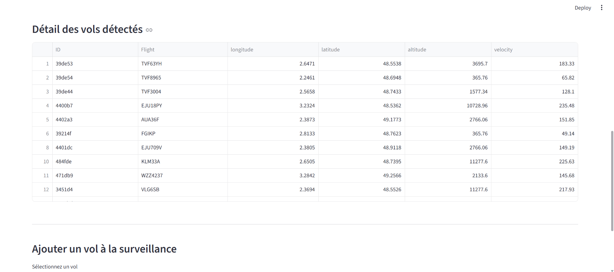

# Mini-ATC - Radar de Trafic Aérien

Mini-ATC est un projet de surveillance du trafic aérien en temps réel au-dessus de Paris CDG.
C'est un mini-projet créé pour **apprendre** et pratiquer avec les APIs, pandas et SQLite.

## Ce que j'ai appris

Ce projet m'a permis de pratiquer et améliorer mes connaissances sur:

- **APIs REST** - Intégration avec OpenSky Network (authentification OAuth2, gestion des erreurs)
- **Pandas** - Manipulation et nettoyage de données
- **SQLite** - Création de base de données et requêtes SQL
- **Streamlit** - Création d'interface web interactive avec état et cache
- **Plotly** - Visualisations avec des cartes et graphiques interactifs
- **Docker** - Containerisation, Dockerfile, gestion des secrets en production, variables d'environnement
- **Docker Compose** - Orchestration pour développement local
- **Déploiement** - Configuration et déploiement sur Railway avec gestion des secrets
- **Git & GitHub** - Gestion de version, bonnes pratiques (.gitignore, commits atomiques)

**Note:** J'ai utilisé des IA génératives (ChatGPT, Claude) pour m'aiguiller sur l'architecture, formater le code et ajouter des commentaires. Je n'ai pas laissé l'IA coder à ma place.

## Description du projet 

Mini-ATC affiche les **vols en temps réel** au-dessus de la région de Paris CDG.
L'app récupère les données via l'API OpenSky Network et les affiche sur une **carte interactive**.

On peut aussi **créer une liste de vols à surveiller**  ils seront stockés en base de données.

### Fonctionnalités

- Carte interactive des vols détectés
- Graphiques (altitude/vitesse)
- Liste de surveillance personnelle
- Mise à jour en temps réel
- Persistance en SQLite

## Technologies utilisées

- **Python 3.8+**
- **Streamlit** - Framework web
- **Plotly** - Visualisations
- **Pandas** - Data manipulation
- **SQLite3** - Base de données
- **Requests** - Requêtes HTTP

## Installation et exécution

### Option 1 : Développement local

#### 1. Cloner le projet

```bash
git clone https://github.com/babouzi/mini-atc.git
cd mini-atc
```

#### 2. Créer un environnement virtuel

```bash
python -m venv venv
source venv/bin/activate  # Sur Windows: venv\Scripts\activate
```

#### 3. Installer les dépendances

```bash
pip install -r requirements.txt
```

#### 4. Créer un fichier `.streamlit/secrets.toml`

Il faut d'abord créer un compte OpenSky (gratuit):
1. Allez sur https://opensky-network.org
2. Créez un compte
3. Allez sur https://opensky-network.org/my-opensky/account
4. Créez un nouveau client API
5. Copier votre **Client ID** et **Client Secret**

Créez ensuite un fichier `.streamlit/secrets.toml` à la racine:

```toml
clientId = "votre_client_id"
clientSecret = "votre_client_secret"
```

⚠️ **IMPORTANT:** Ce fichier est en `.gitignore`, ne l'ajoutez jamais sur GitHub!

#### 5. Lancer l'application

```bash
streamlit run app.py
```

L'app s'ouvre automatiquement sur http://localhost:8501

### Option 2 : Docker (développement et production)

#### Avec Docker Compose (recommandé)

```bash
docker-compose up
```

L'app est accessible sur http://localhost:8501

**Note:** Le fichier `.streamlit/secrets.toml` doit exister localement pour le mode développement avec Docker Compose.

#### Avec Docker directement

```bash
docker build -t mini-atc:latest .
docker run -p 8501:8501 \
  -e STREAMLIT_CLIENTID="votre_client_id" \
  -e STREAMLIT_CLIENTSECRET="votre_client_secret" \
  mini-atc:latest
```

### Option 3 : Déploiement sur Railway

1. Pousser votre code sur GitHub
2. Créer un compte sur https://railway.app
3. Connecter votre repo GitHub
4. Railway détecte le Dockerfile et construit automatiquement l'image
5. Ajouter les variables d'environnement dans le dashboard Railway :
   - `STREAMLIT_CLIENTID`
   - `STREAMLIT_CLIENTSECRET`
6. Railway redéploie automatiquement et l'app est accessible via une URL publique

**Avantage:** Pas besoin de serveur, déploiement automatique à chaque push Git.

## Comment l'utiliser?

### Onglet "Radar en temps réel"

1. Cliquez sur le bouton "Actualiser le radar"
2. Attendez quelques secondes
3. Vous voyez tous les vols détectés sur la carte
4. Explorez les graphiques et la table de données
5. Sélectionnez un vol et cliquez "Ajouter ce vol" pour le surveiller



### Onglet "Vols surveillés"

1. Voyez les vols que vous avez ajoutés à votre liste
2. Cliquez "Actualiser les données radar" pour mettre à jour leurs positions
3. Consultez l'historique de tous vos vols surveillés



### Détail des vols détectés

Chaque vol affiche des informations détaillées : identifiant, position, altitude, vitesse et direction.



## 🔧 Structure du code et fichiers

```
mini-atc/
├── app.py                      # Application principale Streamlit
├── Dockerfile                  # Configuration Docker pour production
├── docker-compose.yml          # Configuration Docker Compose pour développement
├── entrypoint.sh               # Script de démarrage (gestion des secrets)
├── requirements.txt            # Dépendances Python
├── .gitignore                  # Fichiers à ignorer (secrets, cache, etc.)
├── .streamlit/
│   └── secrets.toml           # Secrets locaux (ignoré en Git)
├── radar_database.db          # Base de données SQLite (créée automatiquement)
└── README.md                  # Ce fichier
```

### Contenu de app.py

```
app.py
├── TOKEN MANAGER               # Gestion du token OAuth2 OpenSky
├── DATABASE FUNCTIONS          # Gestion SQLite (création, lecture, suppression)
├── API OPENSKY FUNCTIONS       # Récupération des vols en temps réel
├── CREDENTIALS                 # Lecture des secrets (OAuth2)
├── INITIALISATION              # Setup Streamlit au démarrage
└── INTERFACE STREAMLIT         # Interface utilisateur (2 onglets)
    ├── Radar en temps réel     # Affichage de tous les vols
    └── Vols surveillés         # Liste personnalisée avec historique
```

## Données

Les données viennent de l'**API OpenSky Network**:
- Requête: Zone CDG (48.5°N-49.5°N, 2.0°E-3.5°E)
- Latence: ~10-15 secondes (délai réel contre détection)

## Améliorations futures

- **Jeu: Tour de contrôle** - Une interface où on gère les pistes de décollage/atterrissage, on donne les autorisations aux vols (avec des niveaux de difficulté)
- Historique des positions (tracer les vols)
- Notifications quand un vol entre/sort la zone CDG
- Export des données (CSV)
- Dashboard avec statistiques

## Notes et considérations

- Les données OpenSky Network peuvent être limitées selon votre localisation
- L'API gratuite a une limite de débit (rate limiting)
- En développement local, les secrets sont lus depuis `.streamlit/secrets.toml`
- En production (Docker/Railway), les secrets sont passés via variables d'environnement et injectés via le script `entrypoint.sh`
- La base de données SQLite est locale et sera réinitialisée à chaque redémarrage du conteneur. Pour une vraie mise en production avec persistance des données, il faudrait utiliser une base de données externe comme PostgreSQL

## Sécurité

- Les fichiers sensibles (`.streamlit/secrets.toml`, `.env`) sont ignorés par `.gitignore`
- Les secrets ne sont jamais stockés dans le Dockerfile ou l'image Docker
- Les variables d'environnement sensibles doivent être gérées par la plateforme de déploiement (Railway, Heroku, etc.)
## Ressources utiles

- [Documentation OpenSky Network](https://openskynetwork.github.io/opensky-api/)
- [Documentation Streamlit](https://docs.streamlit.io)
- [Documentation Pandas](https://pandas.pydata.org/docs)
- [Documentation SQLite3 Python](https://docs.python.org/3/library/sqlite3.html)

---

**Créé pour apprendre et démontrer des compétences en développement Python** 
